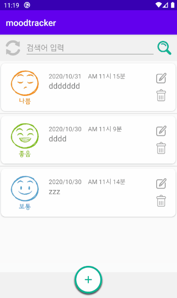
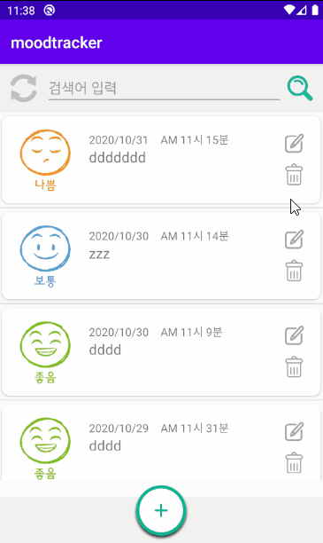

# Android Application Project
***
I made a moodtracker app using android studio(Java), Eclipse(JSP), Oracle
+ moodtracker : android studio files
+ testDB : jsp
+ Oracle table name : moodtracker (columns: imagename, writedate, writetime, memo, num / sequence: moodtracker_seq)

